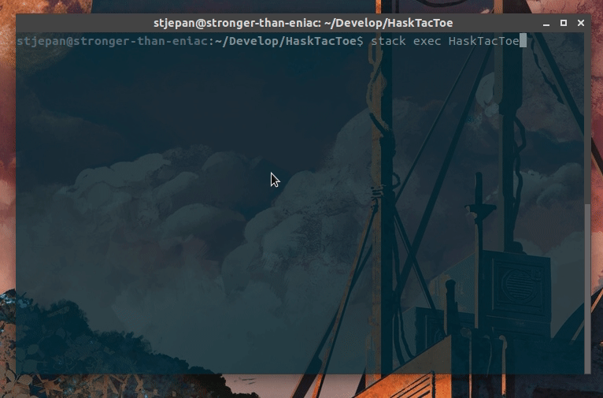

# HaskTacToe

[](https://travis-ci.org/StjepanPoljak/HaskTacToe)

TicTacToe game made in Haskell for Linux terminal. AI uses minimax 
algorithm with adjustable difficulty (if you wish to tinker with the `Main.hs` source file).

## Build

### Stack

First, install [stack](https://docs.haskellstack.org/en/stable/README/#how-to-install). For Ubuntu, it is rather straightforward:

```shell
wget -qO- https://get.haskellstack.org/ | sh
```

You may also need to run:

```shell
export PATH=$PATH:"/home/$(id -un)/.local/bin"
```

### HaskTacToe

Then, in the HaskTacToe folder, do:

```shell
stack init
stack setup
```

After waiting a while (as the GHC is being installed), do:

```shell
stack build
```

If everything went well, you are ready to run HaskTacToe:

```shell
stack exec HaskTacToe
```

## Usage

As with most of my programs, use arrow keys to move, the return key to select and escape to exit. Have fun!

## Demo


